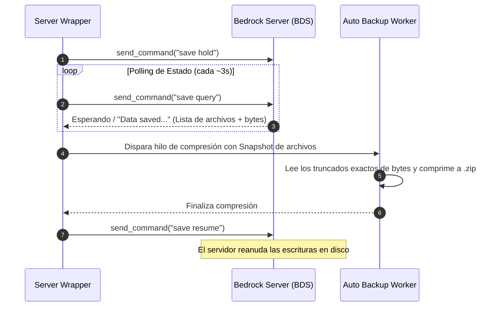

# 🎮 Minecraft Bedrock Dedicated Server — Management & Auto-Backup Suite

[](https://python.org)
[](https://microsoft.com)
[](https://www.minecraft.net/download/server/bedrock)
[](LICENSE)

Sistema completo de administración, wrappers y respaldos automáticos en caliente con cero lag para **Minecraft Bedrock Dedicated Server (BDS)** en Windows.

---

## 📌 Tabla de Contenidos
- [Características Principales](#-características-principales)
- [Estructura del Proyecto](#-estructura-del-proyecto)
- [Requisitos del Sistema](#-requisitos-del-sistema)
- [Instalación y Configuración](#-instalación-y-configuración)
- [Modo de Uso](#-modo-de-uso)
- [Sistema de Backups Automáticos (Wrapper V5.0)](#-sistema-de-backups-automáticos-wrapper-v50)
- [Herramientas de Backup y Restauración Manual](#-herramientas-de-backup-y-restauración-manual)
- [Configuración de Firewall](#-configuración-de-firewall)
- [Herramientas Avanzadas y Scripting API](#-herramientas-avanzadas-y-scripting-api)
- [Recomendaciones para Git / `.gitignore`](#-recomendaciones-para-git--gitignore)
- [Licencia](#-licencia)

---

## ✨ Características Principales

- ⚡ **Respaldos en Caliente (Protocolo Nativo Bedrock):** Implementa `save hold`, polling periódico de `save query` y `save resume` para realizar congelamiento atómico del mundo en tiempo real sin desconectar a los jugadores.
- 🛡️ **Doble Capa de Retención:** Mantiene los **15 respaldos** más recientes y conserva **1 respaldo diario por 7 días**, eliminando archivos antiguos de forma automática.
- 🔒 **Inmunidad contra Corrupción:** Valida la integridad del snapshot y la cantidad exacta de bytes antes de empaquetar. Si ocurre un fallo, renombra el archivo como `_POSIBLEMENTE_CORRUPTO.zip`.
- 🛑 **Cierre Protegido (Ctrl+C / stop):** Intercepta señales de apagado, fuerza el guardado del juego y genera un **Backup Final de Cierre** antes de salir.
- 🔄 **Restauración Interactiva Estilo Realms:** Menú interactivo en consola para explorar y restaurar cualquier copia de seguridad en un solo clic.

---

## 📁 Estructura del Proyecto

```text
.
├── 🚀 iniciar_servidor.bat        # Punto de entrada principal (Lanza el wrapper)
├── 📦 01_hacer_backup.bat         # Backup manual en frío/caliente con Robocopy
├── 🔄 02_restaurar_backup.bat     # Menú interactivo estilo Realms para restaurar ZIPs
├── ↩️ 03_regresar_al_anterior.bat # Reversión rápida en un clic al último backup
├── ⚙️ configurar_firewall.bat     # Abre automáticamente los puertos UDP/TCP 19132-19133
│
├── 🧠 server_wrapper.py           # Wrapper V5.0 (Gestión de subproceso BDS y comandos)
├── 💾 auto_backup.py              # Motor de compresión ZIP y política de retención
├── 🛠️ restore_backup.py           # Motor Python de descompresión y restauración interactiva
│
├── 🧪 enable_beta_apis_v2.py      # Inyector NBT de APIs experimentales en level.dat
├── 🛠️ update_items_v2.py          # Registrador de Scripting API / Componentes personalizados
│
├── 📄 server.properties.example   # Plantilla de configuración del servidor
├── 📄 .gitignore                  # Exclusión de binarios BDS, respaldos y configs locales
├── 📂 worlds/                     # Carpeta contenedora de mundos Bedrock
└── 🌐 behavior_packs / resource_packs # Addons y paquetes de recursos
```

---

## 💻 Requisitos del Sistema

- **Sistema Operativo:** Windows 10 / 11 / Windows Server
- **Python:** Version 3.10 o superior (asegúrate de marcar *"Add Python to PATH"* al instalar).
- **Minecraft Bedrock Dedicated Server:** Descargable desde la web oficial de Minecraft.
- **Librerías Python opcionales (para scripts NBT avanzados):** `amulet-nbt`

---

## 🚀 Instalación y Configuración

1. **Clonar el repositorio:**
   ```bash
   git clone https://github.com/guapo3266/minecraft-bedrock-server-suite.git
   cd minecraft-bedrock-server-suite
   ```

2. **Preparar Configuración:**
   Copia `server.properties.example` a `server.properties` y ajusta tus preferencias.
   ```cmd
   copy server.properties.example server.properties
   ```

3. **Descargar Bedrock Dedicated Server:**
   Descarga la versión oficial de BDS para Windows y coloca el ejecutable `bedrock_server.exe` y sus DLLs en la raíz del proyecto.

4. **Configurar Firewall (Solo la primera vez):**
   Ejecuta `configurar_firewall.bat` como **Administrador** para habilitar los puertos `19132` (UDP/TCP).

---

## 🎮 Modo de Uso

> [!TIP]
> **Para Iniciar el Servidor:**  
> Ejecuta `iniciar_servidor.bat`. Esto iniciará el wrapper inteligente en Python, creará un respaldo inicial y levantará el servidor.

> [!IMPORTANT]
> **Para Apagar el Servidor de forma Segura:**  
> Escribe `stop` en la consola o presiona `Ctrl + C`. El wrapper se encargará de pausar el servidor, ejecutar un **Backup Final de Cierre** y cerrar el proceso limpiamente.

---

## 🛡️ Sistema de Backups Automáticos (Wrapper V5.0)

El motor está coordinado por [`server_wrapper.py`](./server_wrapper.py) y [`auto_backup.py`](./auto_backup.py).

### Ubicación de los Respaldos
Por defecto, los respaldos comprimidos se guardan en la carpeta:
`../../Backups_Minecraft/auto_backups/` (resolución dinámica basada en la estructura del directorio).

### Flujo del Protocolo Nativo de Bedrock


---

## 🛠️ Herramientas de Backup y Restauración Manual

- **📦 Backup Manual (`01_hacer_backup.bat`):** Usa `Robocopy` para hacer respaldos por carpeta (`backup_001`, `backup_002`...) registrando fecha y hora en `BACKUP_INFO.txt`.
- **🔄 Restauración Interactiva (`02_restaurar_backup.bat`):** Ejecuta [`restore_backup.py`](./restore_backup.py) mostrando una lista numerada de copias disponibles para restaurar rápidamente.
- **↩️ Reversión Instantánea (`03_regresar_al_anterior.bat`):** Regresa al último backup realizado y genera automáticamente una copia de seguridad preventiva del estado actual antes de restaurar.

---

## 🌐 Configuración de Firewall

El script [`configurar_firewall.bat`](./configurar_firewall.bat) ejecuta comandos `netsh` para permitir el tráfico entrante:

```cmd
netsh advfirewall firewall add rule name="Minecraft Bedrock Server UDP" dir=in action=allow protocol=UDP localport=19132,19133
netsh advfirewall firewall add rule name="Minecraft Bedrock Server TCP" dir=in action=allow protocol=TCP localport=19132,19133
```

---

## 🧪 Herramientas Avanzadas y Scripting API

- **[`enable_beta_apis_v2.py`](./enable_beta_apis_v2.py):** Modifica el NBT binario de `level.dat` para activar capacidades experimentales como `gametest`, `data_driven_items` y `experimental_custom_ui`.
- **[`update_items_v2.py`](./update_items_v2.py):** Registra componentes personalizados de ítems mediante la Scripting API oficial de Bedrock (por ejemplo, comportamientos de entidades personalizadas o ítems de control).

---

## 📝 Recomendaciones para Git / `.gitignore`

El archivo [`.gitignore`](./.gitignore) excluye binarios pesados y configuraciones locales sensibles:

```gitignore
# Ejecutables y binarios oficiales de Minecraft BDS
bedrock_server.exe
bedrock_server.pdb
*.dll

# Datos de mundos y logs
worlds/
logs/
*.log
packet-statistics.txt

# Configuración local específica del servidor
server.properties
allowlist.json
permissions.json

# Archivos de respaldo
*.zip
*.tmp
Backups_Minecraft/
_POSIBLEMENTE_CORRUPTO*

# Python / Cache
__pycache__/
*.pyc
```

---

## 📄 Licencia

Este proyecto está bajo la Licencia **MIT**. Consulta el archivo `LICENSE` para obtener más información.

> [!NOTE]
> *Minecraft es una marca registrada de Mojang Synergies AB / Microsoft. Este proyecto no está afiliado ni respaldado por Mojang ni Microsoft.*
